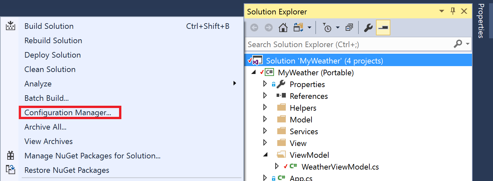
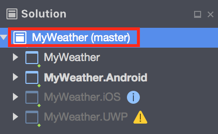
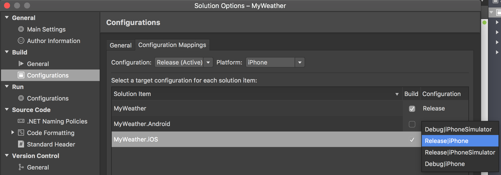

# Configuration mappings
In order to minimize possible errors when building from the **.sln** file and even reduce the build time you can apply the following guidelines to prepare proper configuration mapping in your solution.

If you just like to fix your Xamarin.iOS configuration you can apply the instructions in [the official Azure DevOps (formerly VSTS) guide for Xamarin.iOS task](https://www.visualstudio.com/ru-ru/docs/build/apps/mobile/xamarin#configure-the-solution-for-ios-release).

## Changing a Solution Configuration Mappings
The way you can change your **Configuration Mapping** depends on IDE you use. Here you may change specific project building with current solution configuration using the checkboxes in the Build column. You may want to disable building Android projects for your iOS application here. To disable building UWP projects you will need to use VS for Windows or edit your **.sln** file manually.

#### [Visual Studio](#tab/vswin/)
### 1. In your solution explorer right click the solution and open the **Configuration manager**

### 2. Select the desired active solution configuration and platform

Choose the desired active solution configuration and platform in the upper drop-downs and then select respective project configurations (via dropdowns) and **Build/Deploy** options (via checkboxes). Note that **Deploy** option has no effect for building in App Center. 

You can read additional configuration mappings information in [Visual Studio official documentation](https://docs.microsoft.com/en-us/visualstudio/extensibility/internals/configuration-options-overview).

#### [Visual Studio for Mac](#tab/vsmac/)
### 1. Double click on your solution name in the **Solution Explorer**

### 2. Navigate to **Build > Configurations > Configuration Mappings** in your solution options.

The process for selecting an active configuration and building options is the same as for Windows, just there is no the **Deploy** option.

There is also additional [configuration mappings information for Visual Studio for Mac](https://docs.microsoft.com/visualstudio/mac/create-and-edit-configurations#creating-a-solution-build-configuration).

* * *
## Project Configurations
When you change any project option in your IDE, it can belong to different project configurations. Projects can have multiple configurations, namely *Debug* or *Release*. Switching between those configurations allows for different outputs at build time. For example, when you use a Debug configuration, the output will include debugging symbols, which allows the debugger to resolve function name, parameters, or variables from a crash applications stack trace. This, however, leads to an increased file size and should not be used for publishing in stores.

The project configuration usually consists of two parts, one being the name itself and the other is the platform specification. So for Xamarin.iOS application, the configuration can look like *Release | iPhone* or *Debug | iPhoneSimulator*. If you use Xamarin.Forms for cross-platform development your PCL project can have just *Release* and *Debug* configurations without platform specification since it is there by default.

## Solution Configurations
Solution configurations direct the behavior for your Run/Build command in IDE and also the way App Center builds your application when the **.sln** file is specified for the source. Your solution can have a different set of interdependent projects and the configurations for it can differ from those you have in each project. To arrange those different configuration options under one solution configuration and to opt in or out various projects building you can [change a Configuration Mappings](#changing-a-solution-configuration-mappings). You may want to skip building of Android and UWP projects here, since it is enabled by default when you create your solution or add the new projects.
