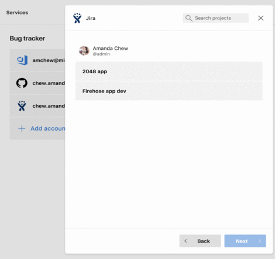
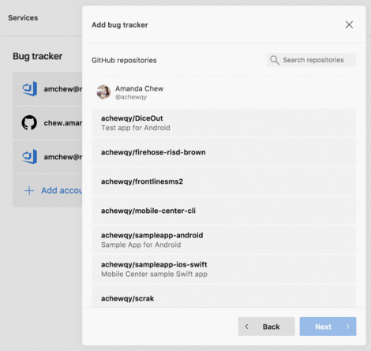

# App Center bug tracker integration

## Overview

App Center has bug tracker integration for the crashes service. Users can be quickly informed about critical App Center events within the tools that you use regularly in your day to day flow for a seamless experience. App Center supports bug trackers like Jira, Visual Studio Team Services (VSTS) and GitHub. Users need to have manager or developer permissions to be able to create and configure the bug tracker.

## Getting Started

1. Navigate to https://appcenter.ms/apps, and select the specific app you would like for bug tracker integration.

1. In your app, select **Settings**, **Services**, and click the **edit** button.

1. <a name="step3"/>Select which bug tracker (Jira, VSTS or GitHub) to integrate with. In order to add a bug tracker for a repository, you need admin permissions for it. 

    1. For Jira:

        1. Login with your Jira credentials (username, password and base URL) and click **Add**. Please see here on [how to find your base URL](https://confluence.atlassian.com/adminjiraserver071/configuring-the-base-url-802593107.html).
        1. Select which Jira projects to integrate the bug tracker with and click **Next**.
        1. Under **Add bug tracker**, fill in the fields for **Number of crashes** and click **Add**:
            - Number of crashes is a threshold you can set for the minimum number of crashes to happen in a crash group before a ticket is created in Jira.

                

    1. For VSTS:

        1. Login with your VSTS credentials and click **Accept** when prompted on app authorization.
        1. Select which VSTS projects to integrate the bug tracker with and click **Next**.
        1. Under **Add bug tracker**, fill in the fields for **Number of crashes**, **Area** and **Default Payload**, and click **Add**:
            - Number of crashes is a threshold you can set for the minimum number of crashes to happen in a crash group before a ticket is created in VSTS.
            - Default payload is an optional field to fill in for use in work items. For example, `{"System.IterationPath": "Area\\Iteration 1", "System.AssignedTo": "Fabrikam"}`. Please refer to the [work item types API](https://docs.microsoft.com/vsts/integrate/#Getaworkitemtype) for additional information.

                

    1. For GitHub:

        1. Login with your GitHub credentials and click **Authorize App Center**.
        1. Select which GitHub repository to integrate the bug tracker with and click **Next**.
        1. Under **Add bug tracker**, fill in the fields for **Number of crashes** and click **Add**:
            - Number of crashses is a threshold you can set for the minimum number of crashes to happen in a crash group before an issue is created in GitHub.

            

1. Done! Your bug tracker is now configured. When a new crash group is created in App Center, it will trigger the creation of a bug in the configured bug tracker.

1. Toggle to the extreme right hand of the bug tracker to **Configure** or **Disconnect** it.

    - **Configure** enables you to change the responses to **Auto create ticket**, **Number of crashes**, **Area**, and **Default payload**.
    - **Disconnect** unlinks all the bugs from your crash group.

1. Bug tracker integration is done at the app level, and only one bug tracker can be configured per app. To change bug trackers:

    1. Go to the **Services** page.
    1. Toggle to the extreme right hand of the bug tracker to **Disconnect** it.
    1. Repeat [step 3](#step3).
