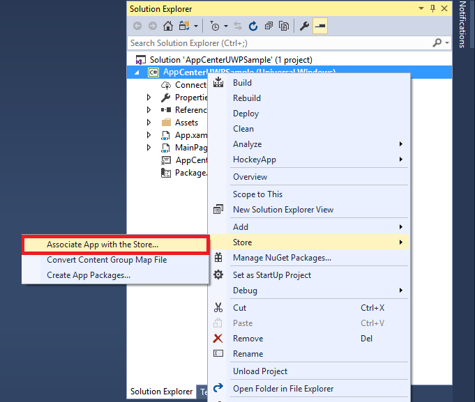
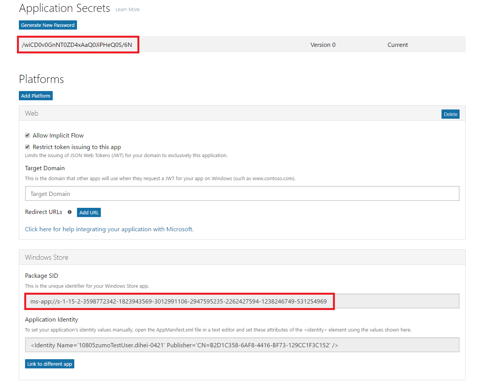

### 1. Windows Store Association in Visual Studio

1. In Visual Studio Solution Explorer, right-click the UWP project, then select **Store -> Associate App with the Store...**

    

2. In the wizard, click **Next**, sign in with your Windows developer account, type a name for your app in **Reserve a new app name**, then click **Reserve**.

3. After completing the app registration, select the new app name, click **Next**, and then click **Associate**. This adds the required Windows Store registration information to the application manifest.

> [!NOTE]
> You must have a Windows Developer account to send push notifications to your UWP app. You can [register a Microsoft developer account](https://developer.microsoft.com/en-us/store/register) if you don't already have one.

### 2. Get Package SID and Application secret from the Application Registration Portal

1. Navigate to the [Microsoft Application Registration Portal](https://apps.dev.microsoft.com/#/appList), sign-in with your Microsoft account. Click the Windows Store app you associated in the previous step.

    

2. In the registration page, make a note of the value under **Application Secrets** and the **Package SID**, which you will use to configure your App Center Push backend.

### 3. Configure Package SID and Security Key in App Center portal

1. Login to [App Center](https://appcenter.ms).
2. Select the application in the left navigator, then select the Push section.
3. Click **Next** button to get to the configuration page.
4. Enter **Package SID** and **Security key** that you obtained from the [Microsoft Application Registration Portal](https://apps.dev.microsoft.com/#/appList) in the previous step.
5. Click **Apply changes**.