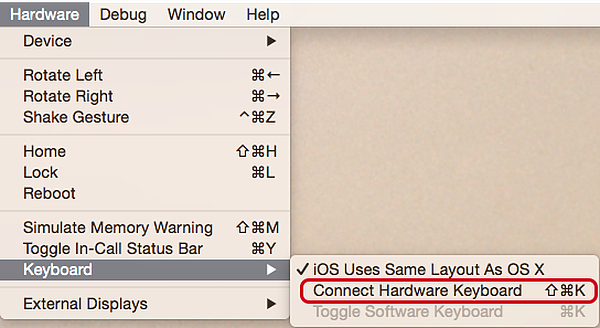

# Entering Text

A common task for test is to enter text into views. UITest provides two API's to address this need:

* `IApp.EnterText`
* `IApp.ClearText`

Each of these will be discussed in more details below.

The `IApp.EnterText` method allows a test to enter text into a view. The behaviour of this method is slightly different between iOS and Android:

* **iOS** &ndash; UITest will display the soft keyboard, and then simulate presses on the keyboard.
* **Android** &ndash; UITest does not use the soft keyboard. Instead, the 
Xamarin Test Cloud Agent transparently injects itself between the soft keyboard
and the application and simulates key presses. 

The following snippet shows is an example of entering text:
 
```csharp
app.EnterText(c=>c.Marked("creditCardTextField"), new string('9', 15));
```
## Disable the Hardware Keyboard

`IApp.EnterText` will fail if the iOS simulator is configured to use the hardware keyboard. Before running your UITests locally, ensure that the simulator is configured to use the soft keyboard.

[ ](./images/working-with-entering-text-01.png#lightbox)

## Clearing Text

The `IApp.ClearText` method will clear the text from the view, for example:

```csharp
app.ClearText(c=>c.Marked("creditCardTextField"));
```
