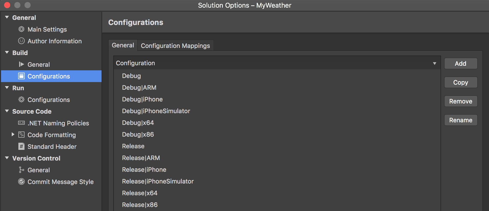

In order to minimize possible build errors when building from `.sln` file you can apply the following guidelines to prepare proper configurations mapping in your solution.

# Project Configurations
When you change the project option it can belong to a different project configurations. Projects can have multiple configurations, namely *Debug* or *Release*. Switching between those configurations allows for different outputs at build time. For example, when you use a Debug configuration, the output will include debugging symbols, which allows the debugger to resolve function name, parameters, or variables from a crash applications stack trace. This, however, leads to an increased file size and should not be used for publishing in stores.

The project configuration usually consists of two parts, one being the name itself and the other is the platform specification. So for Xamarin.iOS application the configuration can look like *AppStore | iPhone* or *Debug | iPhoneSimulator*. If you use Xamarin.Forms for crossplatform development your PCL project can have just *Release* and *Debug* configurations without platform specification, since it is there by default.

# Solution Configurations
Solution configurations direct the behaviour for your Run/Build command in IDE and also the way Mobile Center builds your application, when `.sln` file is specified for the source. Your solution can have a different set of interdependent projects and the configurations for it can differ from those you have in each project. To arrange those different configuration options under one solution configuration and to opt in or out various projects building you can change a *Configuration Mapping*. You may want to skip building of Android projects for reduced build time or even fix a build failure if UWP project is selected to build, since Mobile Center macOS machines does not support building of UWP projects.

## Add, Remove or Edit a Solution Configuration in VS for Windows

## Add, Remove or Edit a Solution Configuration in VS for Mac
To add, remove or edit exising solution configuration please double click on your solution name in the *Solution Explorer*

Then navigate to *Build -> Configurations -> General*

# Changing a Solution Configuration Mappings
The way you can change your *Configuration Mapping* depends on IDE you use.

## Windows users

## macOS users

