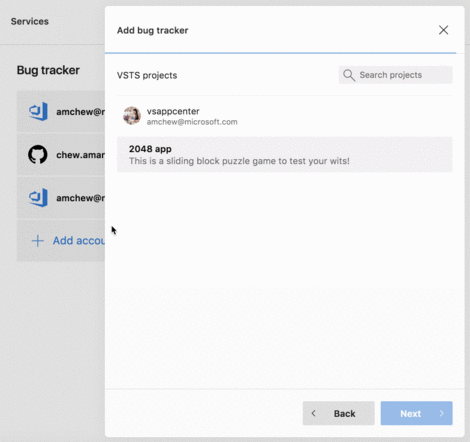

# Mobile Center bug tracker integration
## Overview

Mobile Center has bug tracker integration for the crashes service. Users can be quickly informed about critical Mobile Center events within the tools that you use regularly in your day to day flow for a seamless experience. Mobile Center supports bug trackers like Visual Studio Team Services (VSTS) and Github. Users need to have manage permissions to be able to configure the bug tracker.

## Getting Started

1. Navigate to https://mobile.azure.com/apps, and select the specific app you would like for bug tracker integration.

1. In your app, select **Settings**, **Services**, and click the **edit** button.

1. <a name="step3"/>Select which bug tracker (VSTS or GitHub) to integrate with:

	1. For VSTS:

		1. Login with your VSTS credentials and click **Accept** when prompted on app authorization.
		1. Select which VSTS projects to integrate the bug tracker with and click **Next**.
		1. Under **Add Bug Tracker**, fill in fields for **Area** and **Default Payload**, and click **add**:
			- Default payload is an optional field to fill in for use in work items. For example, `{"System.IterationPath": "Iteration 1", "System.AssignedTo": "Fabrikam"}`. Please see here for all fields with [work item types API](https://docs.microsoft.com/vsts/integrate/#Getaworkitemtype).

	  			

	1. For GitHub:

		1. Login with your Github credentials and click **Authorize MobileCenter**.
		1. Select which Github repository to integrate the bug tracker with and click **Next**.
		1. Under **Add Bug Tracker**, click **Add**:

			

1. Done! Your bug tracker is now configured. When a new crash group is created in Mobile Center, it will trigger the creation of a bug in the configured bug tracker.

1. Toggle to the extreme right hand of the bug tracker to **Configure** or **Disconnect** it.

	- **Configure** enables you to change the responses to **Auto create ticket**, **Area**, and **Default payload**.
	- **Disconnect** unlinks all the bugs from your crash group.

1. Bug tracker integration is done at the app level, and only one bug tracker can be configured per app. To change bug trackers:

	1. Go to the **Services** page.
	1. Toggle to the extreme right hand of the bug tracker to **Disconnect** it.
	1. Repeat [step 3](#step3).
