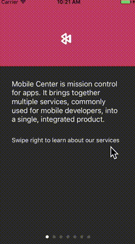

---
# required metadata

title: Analytics | Sample App Tutorials
description: Tutorial to help user set up analytics, track custom events and check logflow.
keywords: mobile-center
authors: sabrinaj206 sshibu
ms.author: t-sajia t-shshib
ms.date: 06/26/2017
ms.topic: article
ms.service: mobile-center
ms.custom: samples
ms.prod: .net-core
ms.assetid: 5c001eab-b3da-476e-ba84-2fa7eb6f500f

# optional metadata

#ROBOTS:
#audience:
#ms.devlang: dotnet
#ms.reviewer: [ALIAS]

---

# Analytics

We've included code to track custom events in sample app. In this tutorial, you will learn to view those events and other user analytics in Mobile Center.

If you have not already, first follow the [getting started tutorial](getting-started.md) to set up the sample app.

## Open the app and view user Analytics
1. Run the app using .xcworkspace, or from your device.
2. Go to the **Analytics** service in [Mobile Center](https://mobile.azure.com/apps).

Once the app runs on any device or simulator, you should start seeing users, session, and other information on the Overview page.

## Send and view custom events

1. In the sample app, press the **Send a sample event** button.
2. In the sample app, press the **Send event with color property** button. Choose a color.
3. Navigate to the **Analytics** service in [Mobile Center](https://mobile.azure.com/apps) and go to the **Events** section.
4. You should see data for both the sample and color event buttons. Click on the color event to see that the color you chose has been pressed at least once.  
  

In Mobile Center, you can view detailed analytics about both buttons by clicking on the events, and even see how many people chose each color.

To make this possible, we've included code from the Mobile Center SDK that will specifically track when these buttons are pressed. These custom events can have multiple properties - in this case, the color chosen is an event property.
