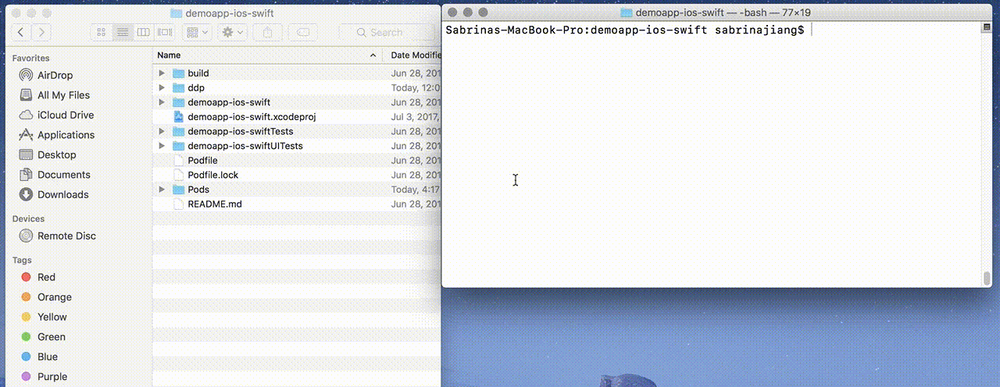
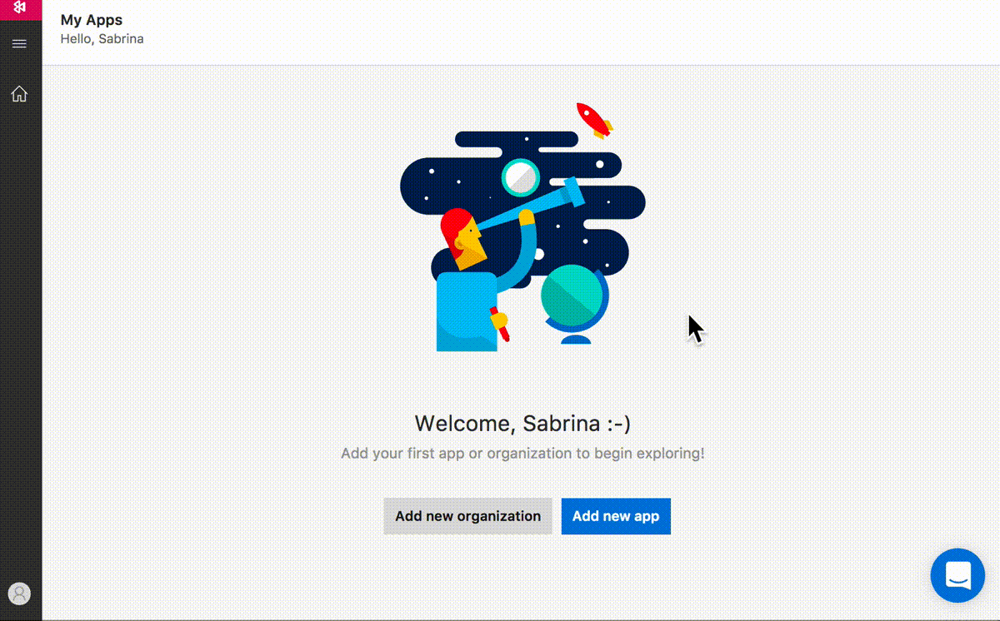
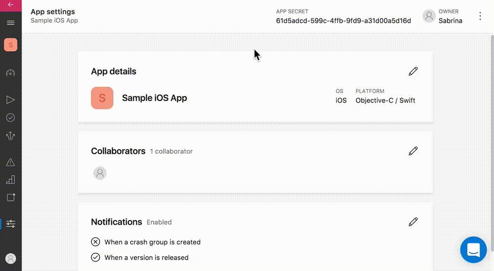
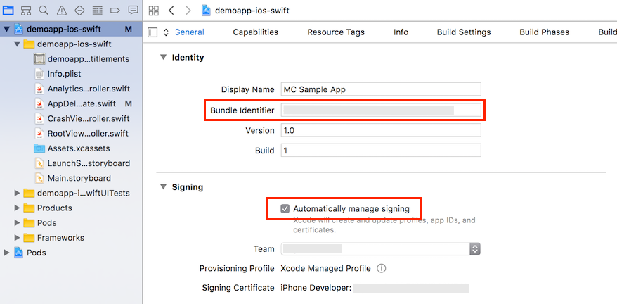

---
# required metadata

title: Getting Started | Sample App Tutorials
description: Tutorial to onboard an iOS application in Mobile Center
keywords: mobile-center
authors: sabrinaj206 sshibu
ms.author: t-sajia t-shshib
ms.date: 06/26/2017
ms.topic: article
ms.service: mobile-center
ms.custom: samples
ms.prod: .net-core
ms.assetid: f2af4edd-7d50-4e2d-8dd2-04eea4b755eb

# optional metadata

#ROBOTS:
#audience:
#ms.devlang: dotnet
#ms.reviewer: [ALIAS]

---


# Getting Started

In this tutorial, you will learn how to set up a sample iOS app with Mobile Center.

### Prerequisites
- [GitHub account](https://github.com/join)
- [Xcode](https://itunes.apple.com/us/app/xcode/id497799835?mt=12#)

## Login to Github and fork the repository
1. Login to your [GitHub account](https://github.com/join).
2. Access the [sample app's GitHub repository](https://github.com/MobileCenter/sampleapp-ios-swift).
3. Click **Fork** at the top right hand corner of the page.

## Integrate CocoaPods
1. Open a terminal and go to the sample app's directory.
2. Run the command below to install CocoaPods:

  ```shell
  sudo gem install cocoapods
  ```

3. We've included the Podfile listing the dependencies in the source code. To install them, run the command below to install dependencies:

  ```shell
  pod install
  ```

4. Open the **.xcworkspace** and press **Run**. The app should build without error.

  

## Sign in to Mobile Center
1. Open the [Mobile Center portal](https://mobile.azure.com).
2. Click **Connect with GitHub** and log in, or use another provider.

## Create a new app in Mobile Center
1. Click **Add new app**.
2. Name the app **Sample iOS App**.
3. Choose **iOS** and **Objective-C / Swift**.
4. Click **Add new app** at the bottom.    
  

## Replace the App Secret

In order for the sample app to send information to Mobile Center, the app secret must be changed in Xcode.

1. Navigate to the **Settings** page in Mobile Center.
2. Copy the **App Secret** at the top.
3. Open the **.xcworkspace** from the sample app folder.
4. In **AppDelegate.swift**, edit the **didFinishLaunchingWithOptions** delegate method and paste your App Secret at the placeholder.  
5. **Add, commit, and push changes to your forked repository.** This can be done from the terminal, or a tool of your choice.
  

## Codesign the project

This section is optional, but recommended.

In order to run tests, distribute the app to users, and send push notifications, the code must be signed. After creating an App ID for the sample app, follow the steps below to sign your code. Read more at the [Apple Developer Documentation](https://developer.apple.com/library/content/documentation/IDEs/Conceptual/AppDistributionGuide/MaintainingProfiles/MaintainingProfiles.html)

  1. Open **.xcworkspace** from the sample app's folder.
  2. Go to **General** within the .xcodeproj file and change the information under the **Signing** tabs.
  3. Edit the **Bundle Identifier** to match the app ID.
  4. Select **Automatically manage signing** to point to Xcode to a certificate installed on your machine. Also, be sure to select your team below.  
    
