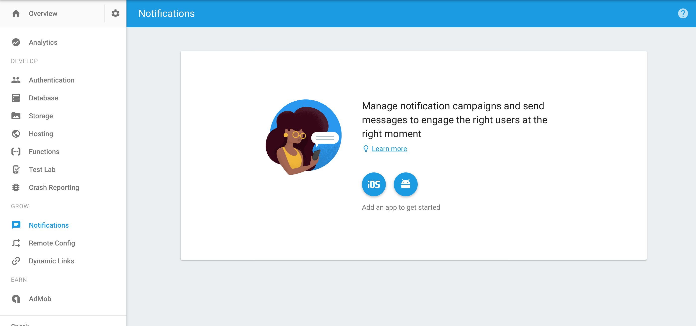

---
# required metadata

title: Mobile Center Push for Xamarin.Android Apps
description: Integrating Mobile Center Push into Xamarin.Android applications
keywords: sdk, push
author: elamalani
ms.author: emalani
ms.date: 10/04/2017
ms.topic: article
ms.assetid: 3f3e83cd-0f05-455e-8e67-6b6d5042949d
ms.service: mobile-center
ms.custom: sdk
ms.tgt_pltfrm: xamarin.android
---

# Mobile Center Push

> [!div class="op_single_selector"]
> * [Android](android.md)
> * [iOS](ios.md)
> * [UWP](uwp.md)
> * [Xamarin.Android](xamarin-android.md)
> * [Xamarin.iOS](xamarin-ios.md)
> * [Xamarin.Forms](xamarin-forms.md)
> * [React Native Android](react-native-android.md)
> * [React Native iOS](react-native-ios.md)

Mobile Center Push enables you to send push notifications to users of your app from the Mobile Center portal. Mobile Center portal and the Push SDK is integrated with [Firebase Cloud Messaging](https://firebase.google.com/docs/cloud-messaging/).

> [!NOTE]
> Firebase displays a notification in the system notification center only if the application is in background at the moment the Push is received.

## Prerequisite - Add Firebase to your app

### 1. Create a Firebase project

The first step in integrating your application with Mobile Center Push is to integrate it with Firebase Cloud Messaging. Start by creating a Firebase project in Google's [Firebase console](https://console.firebase.google.com). Sign in with your Google account and proceed to the console. To create a Firebase project, select the **add project** button. Next, enter a project name and select **Create Project**.

Now that you've created a Firebase project, you must configure your application to receive Firebase notifications. On the side menu, select **Notifications** to navigate to the notifications page. To configure your application to receive notifications, select the Android logo (the button to the right of the one that says "iOS").



Follow steps **one** and **two** in the setup window. Since you are creating a Xamarin application, you may ignore step **three**. Finally, make sure to note where you save the *google-services.json* file, as you will need it later.

### 2. Obtain your Android API Key
Go to Project Settings and under Cloud Messaging, copy your Server Key. This will be the Android API Key that you will need to include in the Mobile Center Push portal.

### 3. Customize Proguard configuration

To ensure that the Proguard optimizer doesn't remove certain classes, you must customize its configuration.

#### 3.1. Create a Proguard configuration file

>[!NOTE]
>If you already have a Proguard configuration file in your project, you may skip to step 1.3.2.

Add an empty file to your Xamarin.Android project named *proguard.cfg*. Set the build action to "ProguardConfiguration."


#### 3.2. Add customization to Proguard configuration file
In your Xamarin.Android project, please add the following lines to your `proguard.cfg` file:

```
-dontwarn com.google.android.gms.**
-keep class com.google.firebase.provider.FirebaseInitProvider
-keep class com.google.firebase.iid.FirebaseInstanceIdReceiver
-keep class com.microsoft.azure.mobile.push.TokenService
-keep class com.microsoft.azure.mobile.push.PushMessagingService
```

## Add Mobile Center Push to your app

Please follow the [Get started](~/sdk/getting-started/xamarin.md) section if you haven't set up and started the SDK in your application yet.

### 1. Add the Mobile Center Push module

[!include[](add-nuget.md)]

You may have the following known issues while building:

[!include[](../xamarin-android-push-setup-issues.md)]

### 2. Add the google-services.json File
Locate the *google-services.json* file from step 1 and add it to your project. Set the build action to "GoogleServicesJson."


> [!IMPORTANT]
> If you do not see this option under build actions, make sure you've added the Mobile Center Push NuGet package already. If you have and it still doesn't appear, try restarting your IDE.

### 3. Modify AndroidManifest.xml

Edit **AndroidManifest.xml** and insert the following `<receiver>` elements into the `<application>` section:

```xml
  <receiver 
      android:name="com.google.firebase.iid.FirebaseInstanceIdInternalReceiver" 
      android:exported="false" />
  <receiver 
      android:name="com.google.firebase.iid.FirebaseInstanceIdReceiver" 
      android:exported="true" 
      android:permission="com.google.android.c2dm.permission.SEND">
      <intent-filter>
          <action android:name="com.google.android.c2dm.intent.RECEIVE" />
          <action android:name="com.google.android.c2dm.intent.REGISTRATION" />
          <category android:name="${applicationId}" />
      </intent-filter>
  </receiver>
```

### 4. Start Mobile Center Push

[!include[](start-push.md)]

>[!NOTE]
>If your Xamarin.Android project is part of a [Xamarin.Forms](xamarin-forms.md) application, it is not necessary to add the call to `MobileCenter.Start()` in the Xamarin.Android portion of the project. The method call can instead be made from the PCL or shared project portion of your Xamarin.Forms application.

## Intercept push notifications

### Additional setup

If (**and only if**) your launcher activity uses a `launchMode` of `singleTop`, `singleInstance` or `singleTask`, you need to add this in the activity `onNewIntent` method:

```csharp
        protected override void OnNewIntent(Android.Content.Intent intent)
        {
            base.OnNewIntent(intent);
            Push.CheckLaunchedFromNotification(this, intent);
        }
```

### Subscribe to the push event

[!include[](dotnet-push-event-intro.md)]

> [!NOTE]
> Firebase does not generate notifications when the push is received in foreground.

> [!NOTE]
> If the push is received in background, the event is **NOT** triggered at receive time.
> The event is triggered when you click on the notification.

> [!NOTE]
> The Firebase SDK does **NOT** expose **title** and **message** to the background notification click callback.
> **Title** and **message** are only available in **foreground** pushes.

[!include[](dotnet-push-event-example.md)]

## Existing Firebase Analytics users

Mobile Center Push has a dependency on Firebase. Firebase Analytics is included in the core Firebase module and therefore, it's a dependency for Firebase messaging. Mobile Center Push SDK automatically disables Firebase Analytics to prevent unwanted data collection by Firebase.

If you are a Firebase customer and want to keep reporting analytics data to Firebase, you need to call `Push.EnableFirebaseAnalytics()` before `MobileCenter.Start()` like so:

```csharp
Push.EnableFirebaseAnalytics();
MobileCenter.Start("{Your App Secret}", typeof(Analytics), typeof(Crashes), typeof(Push));
```

## Enable or disable Push at runtime

[!include[](enable-or-disable.md)]
